<div align="center">



<br>

<a href="https://github.com/henrychooi?tab=repositories"></a>
<a href="https://github.com/henrychooi/henrychooi/issues/new?title=%5Bama%5D%20&body=ask%20away%20%E2%80%94%20code%2C%20uni%2C%20agents%2C%20markets%2C%20anything.%20i%20answer%20in%20the%20thread.%0A%0A---%0A%0A"></a>

</div>

<br>

---

### <code>01</code> &nbsp; ~/whoami

I build things that get used, not things that get demoed. Most of my repos start as a problem I personally hit twice in a week — the third time I write the tool.

```toml
# ~/.config/henry.toml

[identity]
name      = "Li Hang (Henry)"
location  = "Singapore"
studying  = "Computer Science @ NTU"

[building]
now       = ["agent harnesses", "dev tooling", "things that automate my own life"]
default   = "ship it ugly, then make it sharp"

[enjoys]
problems  = "the ones where the answer isn't googleable"
users     = "real ones — even if that's one user and it's me"
habit     = "understanding *why* a design won, not copying it"
```

<br>

---

### <code>02</code> &nbsp; ~/stack

<div align="center">

<a href="https://github.com/henrychooi?tab=repositories&language=python"></a>
<a href="https://github.com/henrychooi?tab=repositories&language=typescript"></a>
<a href="https://github.com/henrychooi?tab=repositories&language=javascript"></a>
<a href="https://github.com/henrychooi?tab=repositories&language=java"></a>
<a href="https://github.com/henrychooi?tab=repositories&language=c"></a>
<a href="https://github.com/henrychooi?tab=repositories&language=html"></a>

<sub><i>↑ real links — each one filters my repos by that language</i></sub>

</div>

<br>

<details>
<summary><b>&nbsp;↳ frameworks · data · infra</b></summary>

<br>

<div align="center">

<sub><b>FRAMEWORKS & RUNTIME</b></sub><br>


<br><br>

<sub><b>DATA & ML</b></sub><br>


<br><br>

<sub><b>INFRA & TOOLING</b></sub><br>


</div>

</details>

<br>

---

### <code>03</code> &nbsp; ~/stats

<details>
<summary><b>&nbsp;↳ numbers, if you're into that</b></summary>

<br>

<div align="center">

<!-- theme-adaptive: light card for light-mode visitors, dark for dark-mode -->
<picture>
  <source media="(prefers-color-scheme: light)" srcset="https://github-readme-stats.vercel.app/api?username=henrychooi&show_icons=true&hide_border=true&theme=graywhite&title_color=0891b2&icon_color=0891b2&rank_icon=github&card_width=450&cache_seconds=86400" />
  
</picture>

<br><br>


</div>

<br>

> Served by a shared free instance that rate-limits under load. Blank box or error? See the note at the bottom of this file — the markdown is fine.

</details>

<br>

---

<div align="center">

<sub><code>$</code> &nbsp;<i>most profiles are a stack of badge generators. the header above is hand-written — steal it.</i></sub>

</div>
